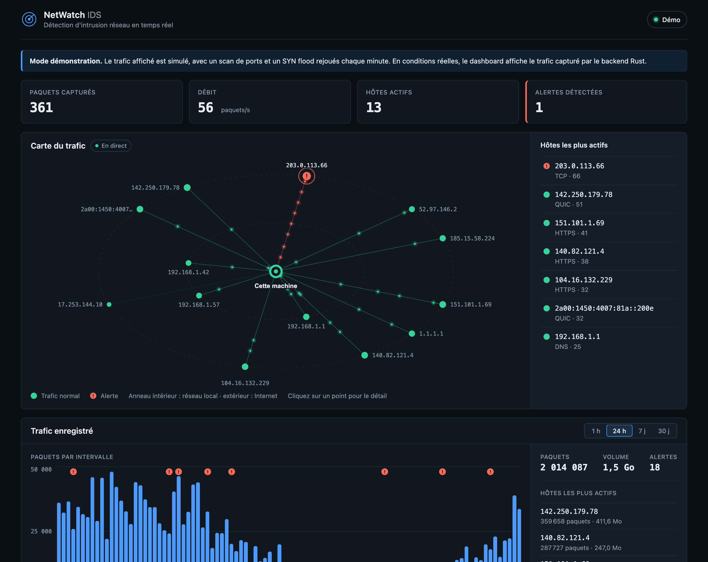
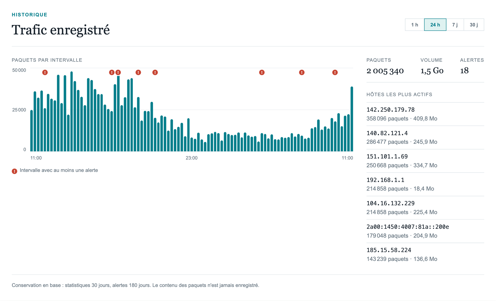
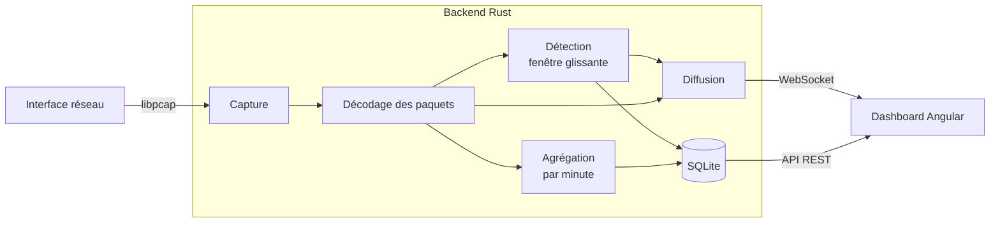

# NetWatch IDS

[](https://github.com/IbrahimKakaev/netwatch-ids/actions/workflows/ci.yml)
[](https://github.com/IbrahimKakaev/netwatch-ids/actions/workflows/pages.yml)
[](https://github.com/IbrahimKakaev/netwatch-ids/actions/workflows/ci.yml)
[](https://github.com/IbrahimKakaev/netwatch-ids/actions/workflows/pages.yml)
[](https://github.com/IbrahimKakaev/netwatch-ids/actions/workflows/pages.yml)

[](https://www.rust-lang.org/)
[](https://angular.dev/)
[](https://www.typescriptlang.org/)
[](https://www.sqlite.org/)
[](https://github.com/IbrahimKakaev/netwatch-ids/commits/main)
[](LICENSE)

Système de détection d'intrusion réseau en temps réel : un moteur de capture et
de détection écrit en **Rust**, et un dashboard **Angular** qui rend le trafic
lisible d'un coup d'œil.



## En bref

- **Capture** des paquets avec libpcap et décodage maison d'Ethernet, VLAN,
  IPv4, IPv6 (en-têtes d'extension compris), TCP et UDP.
- **Détection** de scans de ports, de SYN floods et de débits anormaux, par
  source, sur fenêtre glissante.
- **Carte en direct** : la machine au centre, les hôtes autour, un nœud rouge
  dès qu'une alerte tombe. Un clic donne le détail d'un hôte.
- **Historique** en base SQLite, purgé automatiquement, consultable sur
  1 heure à 30 jours.
- **Mode démo** : le dashboard fonctionne seul, sans backend, avec un trafic
  simulé et des attaques rejouées.
- **Testé** : tests unitaires côté Rust et côté Angular, lancés à chaque push,
  avec la couverture mesurée et publiée dans les badges ci-dessus.

## Démo en ligne

**[ibrahimkakaev.github.io/netwatch-ids](https://ibrahimkakaev.github.io/netwatch-ids/)**

Le dashboard embarque un simulateur : trafic ordinaire en continu, puis un scan
de ports et un SYN flood rejoués chaque minute. La démo en ligne est publiée
automatiquement à chaque push. Pour la lancer en local :

```bash
cd frontend
npm install
npm start
```

Ouvrez `http://localhost:4200/?demo`. Hébergé comme site statique
(`npm run build`, puis le dossier `dist/frontend/browser`), le dashboard passe
en mode démo de lui-même, puisqu'aucun backend local n'est joignable.



## Architecture



```
backend/src/
  packet.rs     décodage des trames, sans dépendance
  detection.rs  règles de détection et compteurs par source
  storage.rs    base SQLite, agrégation, purge
  capture.rs    boucle de capture libpcap
  server.rs     WebSocket, API d'historique, contrôle d'origine
frontend/src/app/
  network-map/      carte animée (canvas)
  traffic-history/  graphique de l'historique
  models/           agrégation du flux par hôte
  services/         WebSocket avec reconnexion, API, simulateur de démo
```

| Couche | Technologies |
| --- | --- |
| Capture et détection | Rust, libpcap, Tokio |
| Serveur | axum (WebSocket et REST) |
| Stockage | SQLite (rusqlite) |
| Interface | Angular 22 (signals, sans zone), canvas 2D |
| Qualité | cargo test, clippy, rustfmt, Vitest, GitHub Actions |
| Déploiement | GitHub Pages (démo) |

## Choix techniques

- **Le thread de capture est séparé du serveur.** libpcap est bloquant ; le
  serveur est asynchrone. Un canal de diffusion relie les deux, et un client
  trop lent saute des événements au lieu de ralentir la capture.
- **Le décodage ne peut pas paniquer.** Chaque accès vérifie la longueur du
  paquet : une trame tronquée ou malformée produit un message, pas un plantage.
- **La mémoire est bornée partout.** Nombre de sources suivies, historique en
  mémoire, hôtes par minute : un flood d'adresses usurpées ne fait pas grossir
  le processus.
- **Le flux n'est pas exposé.** Le serveur n'écoute que sur la boucle locale et
  vérifie l'en-tête `Origin` des WebSockets, que CORS ne protège pas.
- **Les paquets ne sont pas stockés.** Seuls des agrégats et les alertes vont
  en base : volume maîtrisé, et pas de contenu privé conservé.
- **L'affichage est découplé du débit.** Le dashboard reçoit chaque paquet mais
  ne se redessine que deux fois par seconde ; la carte anime des échanges, pas
  des paquets.

## Installation

### Prérequis

- Rust (édition 2024) et libpcap
- Node.js et npm

### Lancer le backend

La capture demande les droits administrateur. Compilez sans `sudo`, puis lancez
le binaire avec : exécuter `sudo cargo run` rend le dossier `target/`
propriété de `root` et bloque les compilations suivantes.

```bash
cd backend
cargo build
sudo ./target/debug/backend
```

Le serveur écoute sur `127.0.0.1:3000`, diffuse les événements sur `/ws` et
sert l'historique sur `/api/history?hours=24`.

Si un ancien `sudo cargo run` a laissé des fichiers appartenant à `root`,
`cargo build` échoue avec « Permission denied ». Rendez-les à votre utilisateur :

```bash
sudo chown -R $(whoami) ~/.cargo backend/target
```

### Lancer le frontend

```bash
cd frontend
npm install
npm start
```

Le dashboard est servi sur `http://localhost:4200` et se reconnecte
automatiquement si le backend redémarre.

## Configuration

Toutes les variables d'environnement sont optionnelles.

| Variable | Défaut | Rôle |
| --- | --- | --- |
| `IDS_INTERFACE` | interface par défaut de libpcap | Interface à écouter (`en0`, `lo0`...) |
| `IDS_BIND` | `127.0.0.1:3000` | Adresse d'écoute du serveur |
| `IDS_ALLOWED_ORIGINS` | `http://localhost:4200,http://127.0.0.1:4200` | Origines autorisées à ouvrir le WebSocket |
| `IDS_WINDOW_SECS` | `10` | Fenêtre glissante des règles |
| `IDS_RATE_THRESHOLD` | `20000` | Paquets d'une source distante dans la fenêtre |
| `IDS_PORT_SCAN_THRESHOLD` | `20` | Ports distincts visés par des SYN dans la fenêtre |
| `IDS_SYN_FLOOD_THRESHOLD` | `300` | SYN d'une même source dans la fenêtre |
| `IDS_COOLDOWN_SECS` | `30` | Délai entre deux alertes identiques pour une source |
| `IDS_DB_PATH` | `ids.db` | Fichier de la base SQLite |
| `IDS_STATS_RETENTION_DAYS` | `30` | Conservation des statistiques de trafic |
| `IDS_ALERT_RETENTION_DAYS` | `180` | Conservation des alertes |

Avec `sudo`, passez-les après la commande : `sudo IDS_INTERFACE=lo0 ./target/debug/backend`.

Le flux n'est pas authentifié : n'exposez `IDS_BIND` sur une autre adresse que
la boucle locale que sur un réseau de confiance.

## Règles de détection

Les compteurs sont tenus par IP source (IPv4 et IPv6) sur une fenêtre glissante.

| Règle | Gravité | Déclenchement |
| --- | --- | --- |
| `high_rate` | Faible | Une source distante dépasse le seuil de paquets. Les adresses de la machine sont exclues. |
| `port_scan` | Moyenne | Une source envoie des SYN vers trop de ports distincts. |
| `syn_flood` | Élevée | Une source envoie trop de SYN, tous ports confondus. |

Une même alerte n'est pas répétée pour une source avant la fin du délai de
silence, pour ne pas noyer l'opérateur.

## Base de données et conservation

Le backend enregistre dans un fichier SQLite, créé au premier lancement :

| Donnée | Détail | Conservation par défaut |
| --- | --- | --- |
| Alertes | Règle, source, message, horodatage | 180 jours |
| Trafic total | Paquets et octets par minute | 30 jours |
| Trafic par hôte | Paquets et octets par heure | 30 jours |

Les paquets eux-mêmes ne sont pas stockés : sur un réseau actif ils
représentent des millions de lignes par jour, et leur contenu relève de la vie
privée. Les statistiques sont écrites toutes les dix secondes, et une purge
supprime les données expirées au démarrage puis toutes les heures.

## Lire le dashboard

- **Carte en direct** : cette machine est au centre, les hôtes du réseau local
  sur l'anneau intérieur, ceux d'Internet sur l'anneau extérieur. Les points
  verts qui circulent représentent les échanges. Un nœud rouge marqué « ! »
  signale une alerte pendant une minute.
- **Détail d'un hôte** : cliquez sur un nœud, ou sur un hôte de la liste, pour
  voir son volume, ses services et ses alertes. Le flux réseau est alors filtré
  sur cet hôte.
- **Trafic enregistré** : l'historique lu dans la base, sur 1 heure, 24 heures,
  7 jours ou 30 jours. Les intervalles où une alerte s'est produite sont marqués
  d'un « ! ». Il survit aux redémarrages du backend.
- **Flux réseau** : rafraîchi deux fois par seconde, avec un bouton de pause.

## Tests

```bash
cd backend && cargo test
cd frontend && npm test
```

## Limites et pistes

- Les règles reposent sur des seuils : un débit élevé peut être un simple
  téléchargement, d'où sa gravité faible. Une détection par signatures ou par
  écart à une ligne de base serait l'étape suivante.
- Les hôtes sont désignés par leur adresse IP ; une résolution DNS inverse les
  rendrait plus parlants.
- Le flux n'est pas authentifié : le backend est prévu pour un usage local.
- La capture suppose un lien Ethernet ou la boucle locale.

## Licence

[MIT](LICENSE)
